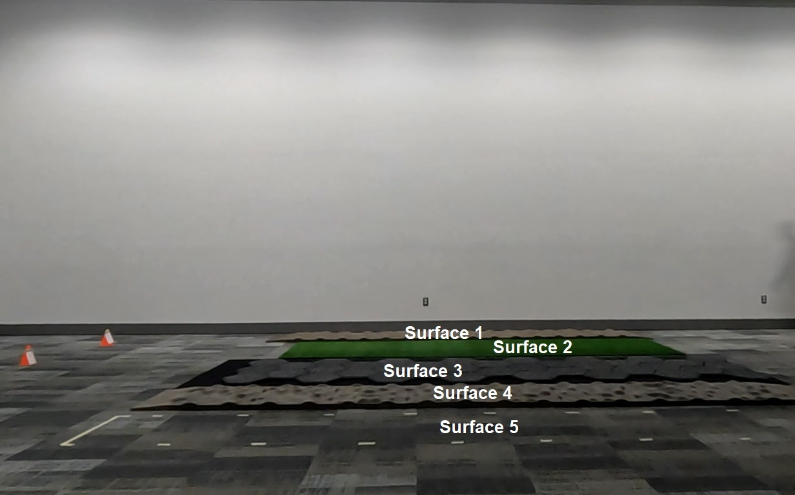

# Video Annotation Tool

## Overview
This Python application is designed to annotate sections of a video with the desired classes or labels.  
The annotations are saved to a CSV file for later analysis.

## Statement of need
The manual annotation and labelling of specific moments (events) within a video file is a crucial step in several data processing pipelines, including the creation of machine learning training datasets. In the landscape of open-source tools, there exists a notable absence of readily available software solely dedicated to labelling key moments within videos. Our tool provides a user-friendly environment for marking key moments within video sequences.  

## Getting Started

### Installation instructions
Make sure you have conda installed and added to the path properly.  
Before running the application, follow the next steps to create an environment using conda and install the required dependecies:

From the terminal, `cd` to `video_annotation`, then run the following commands:
- `conda create --name annotate python=3.11 -y`
- `conda activate annotate`
- `pip install -r requirements.txt`

### Usage
To start the application, open your terminal and run the following command from the project root directory:
```bash
python annotate_video.py
```
Note that you should have a file called `buttons.txt` where you specify the desired button names for your use case.

## Example usage
The graphical user interface should show a button to open a video file, choose the provided video example and start annotating the different moments where the participant makes first and last contact with each surface. 

When done annotating, click the `Save to CSV` button to save the annotations.  
The tool offers the follwoing features:

### Play/Pause
- Use the "Play" button or "Space key" to start playing the video.
- Use the "Pause" button or "Space key" to pause the video playback.

### Next Frame
- Click the "Next Frame" button to advance to the next frame in the video.

### Previous Frame
- Click the "Previous Frame" button to go back to the previous frame in the video.

### Skip Seconds
- Enter the number of seconds you want to skip in the input field provided.
- Click "Skip Forward" to jump forward in the video by the specified number of seconds.
- Click "Skip Backward" to go back in the video by the specified number of seconds.

### Increase/Decrease Speed
- You can control the speed of video playback.
- Use the "Increase Speed" button or "UP arrow" to speed up the video playback.
- Use the "Decrease Speed" button or "Down arrow" to slow down the video playback.

### Save Annotations to CSV
- Click the "Save to CSV" button to save all annotations to a CSV file.
- The CSV file contains columns for Button (label), Frame Number, and Time (in milliseconds).

## Contributing
If you would like to contribute to this project or have suggestions for improvements, please feel free to create issues or pull requests on the GitHub repository.

## License

This project is open-source and available under the [MIT License](LICENSE). You are free to use, modify, and distribute the code in accordance with the terms specified in the license.

The MIT License (MIT)
=====================

[MIT License](https://opensource.org/licenses/MIT)